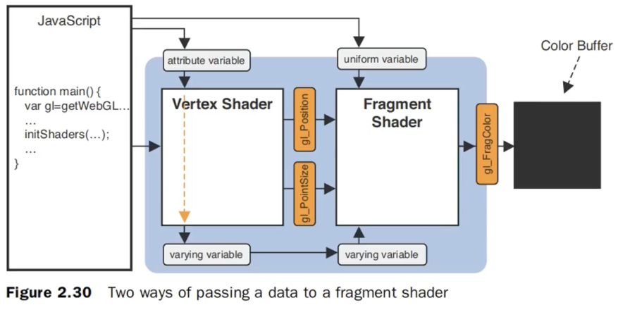
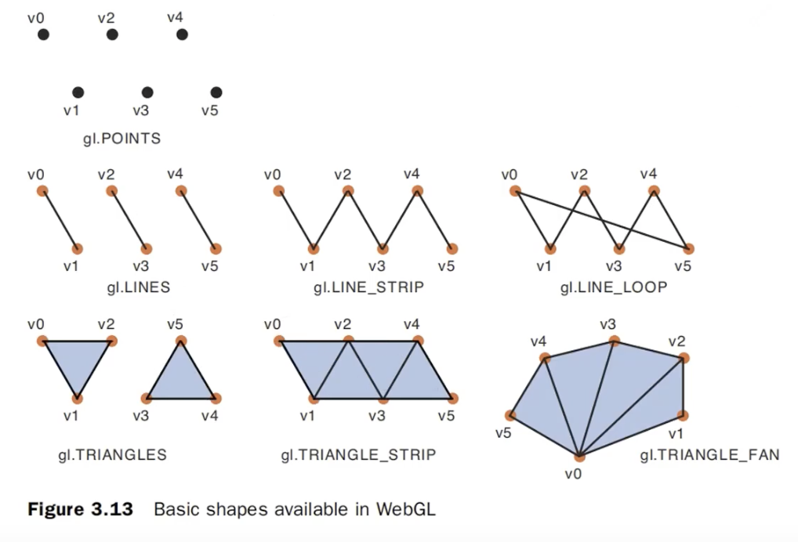
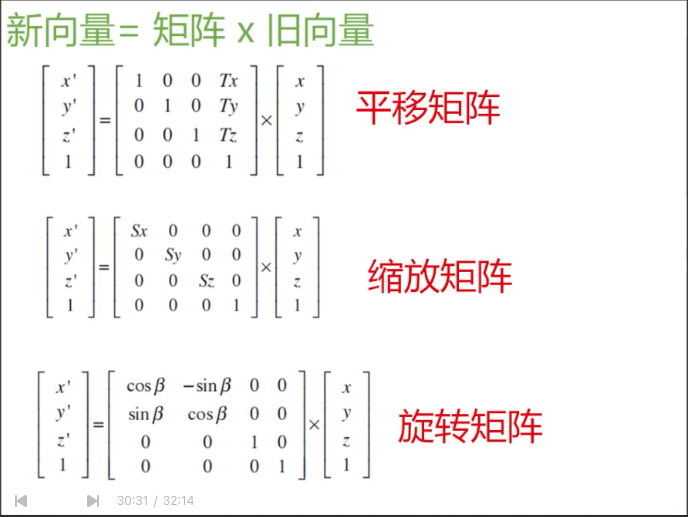

# 笔记


## 渲染管线
- vertexShader
- fragmentShader

## shader传值的三种方式



### 1. Attribute (vertexShader): 将js中的数据传给vertexShader

```js
let a_position = gl.getAttribLocation(gl.program, "a_position");
gl.vertexAttrib2f(a_position, -0.5, 0.5)
```

### 2. Uniform (vertexShader/fragmentShader): 将js中的数据传给vertexShader/fragmentShader

```js
let u_color = gl.getUniformLocation(gl.program, "u_color");
gl.uniform3f(u_color, 0.0, 1.0, 0.0)

let u_size = gl.getUniformLocation(gl.program, 'u_size')
gl.uniform1f(u_size, 30.0)
```  

### 3. Varying: 将vertexShader中的数据传给fragmentShader

## buffer: 表示存储一组点位信息的数组

创建buffer信息数组，有5个步骤：

```js
let vertices = [
  // x    y      r    g   b
  -0.5, 0.0, 1.0, 0.0, 0.0,  // 第一个点的信息
  0.5, 0.0, 0.0, 1.0, 0.0,   // 第二个点的信息
  0.0, 0.8, 0.0, 0.0, 1.0,   // 第三个点的信息
]
vertices = new Float32Array(vertices)
let FSIZE = vertices.BYTES_PER_ELEMENT

// 1. 创建buffer对象
let buffer = gl.createBuffer()
// 2. 绑定buffer
gl.bindBuffer(gl.ARRAY_BUFFER, buffer)
// 3. 将点位信息data注入buffer
gl.bufferData(gl.ARRAY_BUFFER, vertices, gl.STATIC_DRAW)
// 4：把带有数据的buffer赋值给attribute
let a_position = gl.getAttribLocation(gl.program, 'a_position')
gl.vertexAttribPointer(
  a_position,  // location: vertex Shader里面attribute变量的location
  2,           // size: attribute变量的长度（vec2)
  gl.FLOAT,    // type: buffer里面数据的类型
  false,       // normalized: 正交化，true，false, [1, 2] => [1/根号5， 2/根号5]
  5 * FSIZE,   // stride：每个点的信息所占的BYTES
  0            // offset: 每个点的信息，从第几个BYTES开始数
)
// 5. 确认把带有数据的buffer赋值给attribute
gl.enableVertexAttribArray(a_position)
```

## webgl的7种基本形状

- 点 1种  
  - gl.POINTS
- 线 3种
  - gl.LINES
  - gl.LINE_STRIP
  - gl.LINE_LOOP
- 面（三角形） 3种
  - gl.TRIANGLES
  - gl.TRIANGLE_STRIP
  - gl.TRIANGLE_FAN

三角形可以构成任何一个图形，所有的三维图形也是由三角形构成的。



## 三种变换动画（通过变换矩阵）

```js
/**
 * 变换：平移translate、旋转rotate、缩放scale
 */

// 以下是数学上的矩阵
// ***** 平移矩阵 ******
// [
//     1, 0, 0, Tx,
//     0, 1, 0, Ty,
//     0, 0, 1, Tz,
//     0, 0, 0, 1,
// ]

// ****** 旋转矩阵 ******
// [
//     cosB, -sinB, 0, 0,
//     sinB, cosB,  0, 0,
//     0,    0,     1, 0,
//     0,    0,     0, 1,
// ]

// ****** 缩放矩阵 ******
// [
//     Sx, 0,  0,  0,
//     0,  Sy, 0,  0,
//     0,  0,  Sz, 0,
//     0,  0,  0,  1,
// ]
```



**传入webgl时，需要讲变换矩阵进行转置！！！**

```js
// 缩放
let Sx = 1, Sy = 1, Sz = 1
let scale_matrix = [
    Sx, 0, 0, 0,
    0, Sy, 0, 0,
    0, 0, Sz, 0,
    0, 0, 0, 1,
]

// 平移
let Tx = 0, Ty = 0, Tz = 0
let translate_matrix = [
    1, 0, 0, 0,
    0, 1, 0, 0,
    0, 0, 1, 0,
    Tx, Ty, Tz, 1
]

// 旋转
let deg = 0
let cos = Math.cos(deg / 180 * Math.PI), sin = Math.sin(deg / 180 * Math.PI)
let rotate_matrix = [
    cos, sin, 0, 0,
    -sin, cos, 0, 0,
    0, 0, 1, 0,
    0, 0, 0, 1,
]
```

## glMatrix库的使用

官方网站：https://glmatrix.net/

### 引入

```js
import { mat4, glMatrix } from './gl_matrix/esm/index.js'
```

### 使用
- 方式一：对原有的（单位）矩阵进行修改

```js
// 创建一个新的单位矩阵
let matrix = mat4.create()

mat4.fromScaling(matrix, [Sx, Sy, Sz])
mat4.fromTranslation(matrix, [Tx, Ty, Tz])
mat4.fromRotation(matrix, deg, [X, Y, Z])
```

- 方式二：修改某个矩阵，生成另外一个新的矩阵

```js
// matrix1旧矩阵，matrix2新矩阵
let matrix1 = mat4.create()
let matrix2 = mat4.create()

mat4.scale(matrix2, matrix1, [Sx, Sy, Sz])
mat4.rotate(matrix2, matrix1, matrix, deg, [X, Y, Z])
mat4.translate(matrix2, matrix1, [Tx, Ty, Tz])
```

### 多个变换矩阵的组合

```js
let vertexShader = `
attribute vec3 a_position;
uniform mat4 u_tMatrix;
uniform mat4 u_rMatrix;

void main() {
  mat4 modelMatrix =  u_tMatrix * u_rMatrix; // 从右到左执行变换矩阵
  gl_Position = modelMatrix * vec4(a_position, 1.0);
}
`
```


## webgl贴图

```js
let texture = gl.createTexture()

  let u_sampler = gl.getUniformLocation(gl.program, 'u_sampler')

  let image = new Image()
  image.src = './imgs/keyboard_1024x512.jpg'

  image.onload = function () {
    // 翻转图片的Y轴，默认是不翻转
    // 因为canvas的坐标系和图片坐标系y轴是相反的
    gl.pixelStorei(gl.UNPACK_FLIP_Y_WEBGL, true)

    // 激活贴图，放在第0个单元上（最少可以支持8个单元）
    gl.activeTexture(gl.TEXTURE0)
    // 绑定贴图，参数：哪种贴图和哪个贴图
    gl.bindTexture(gl.TEXTURE_2D, texture) 

    // 对贴图的参数进行设置，gl.texParameteri(贴图的种类，参数的名称，具体值)
    gl.texParameteri(gl.TEXTURE_2D, gl.TEXTURE_MIN_FILTER, gl.LINEAR)

    // 贴图用哪张图片，即用image作为texture
    gl.texImage2D(gl.TEXTURE_2D, 0, gl.RGBA, gl.RGBA, gl.UNSIGNED_BYTE, image)

    gl.uniform1i(u_sampler, 0)
  }
```