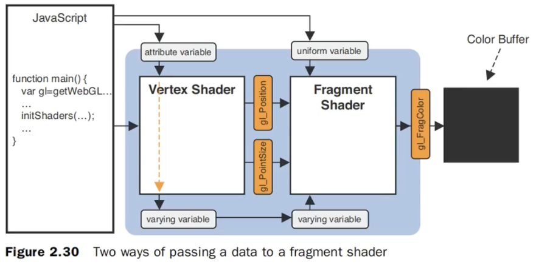

## 笔记

### shader传值的三种方式



1. Attribute (vertexShader): 将js中的数据传给vertexShader
```js
let a_position = gl.getAttribLocation(gl.program, "a_position");
gl.vertexAttrib2f(a_position, -0.5, 0.5)
```

2. Uniform (vertexShader/fragmentShader): 将js中的数据传给vertexShader/fragmentShader
```js
let u_color = gl.getUniformLocation(gl.program, "u_color");
gl.uniform3f(u_color, 0.0, 1.0, 0.0)

let u_size = gl.getUniformLocation(gl.program, 'u_size')
gl.uniform1f(u_size, 30.0)
```

3. Varying: 将vertexShader中的数据传给fragmentShader

